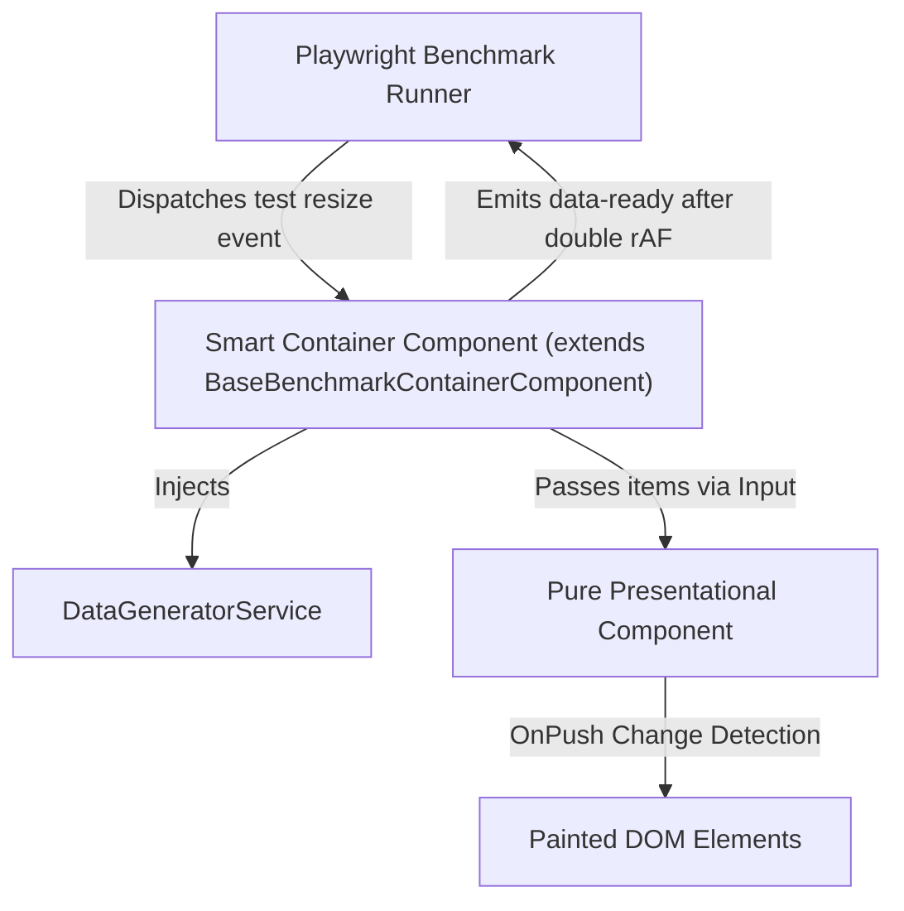

# Component Authoring Guide

This repository benchmarks Angular 18 UI components under high-stress datasets (up to 100,000 items) inside Storybook. All benchmarked components follow a strict **6-file component pattern** (or **8-file benchmark suite**) and a **Smart Container / Pure Presentational (Dumb)** separation.

---

## 1. Architecture: Smart Container vs. Pure Dumb Component



### Pure Presentational (Dumb) Component (`<name>.component.ts`, `<name>.component.html`, `<name>.component.less`)
- **`standalone: true`** with **`changeDetection: ChangeDetectionStrategy.OnPush`**.
- Separates view logic (`.component.ts`), template (`.component.html`), and styles (`.component.less`) via `templateUrl` and `styleUrl`.
- Accepts data strictly through `@Input()` (e.g., `@Input() items: Item[] = [];`).
- Manages interactive client-side UI state internally (sorting, filtering, paging, expansion).
- **Zero test coupling**: Never import `DataGeneratorService`, listen to test events, or declare test host attributes (`[data-ready]`).

### Smart Benchmark Container (`<name>-container.component.ts`)
- **`standalone: true`**. Extends `BaseBenchmarkContainerComponent<T>` from `../common/base-benchmark-container`.
- Injects `DataGeneratorService` to generate items.
- Inherits:
  - Host attributes: `[attr.data-ready]` and `[attr.aria-busy]`.
  - `@Input() datasetSize: number` (with automatic sanitization and change detection).
  - Event listener for `window:storybook-<componentName>-size`.
  - Race-condition guarding (`generationId`) and double `requestAnimationFrame` paint readiness synchronization.
- **Implementation pattern**:
  ```typescript
  @Component({
    selector: 'storybook-my-comp-container',
    standalone: true,
    imports: [MyCompComponent],
    template: `<storybook-my-comp [items]="items"></storybook-my-comp>`,
  })
  export class MyCompContainerComponent extends BaseBenchmarkContainerComponent<MyItem> {
    protected override readonly componentName = 'my-comp';
    private readonly dataGenerator = inject(DataGeneratorService);

    items: MyItem[] = [];

    protected override async generateDataset(size: number): Promise<MyItem[]> {
      return this.dataGenerator.generate(myItemSchema, size, { overrides: myItemOverrides });
    }

    protected override onDataGenerated(items: MyItem[]): void {
      this.items = items;
    }
  }
  ```

---

## 2. The 6-File Component Pattern

Every component lives in its own directory under `src/stories/<name>/`:

| File | Purpose | Key Responsibilities |
|---|---|---|
| `1. <name>.schema.ts` | Data contract | Zod schemas (`z.object(...)`), TypeScript types (`z.infer`), mock data factories |
| `2. <name>.component.ts` | Dumb UI class | `OnPush`, pure `@Input()`, references external template and style |
| `3. <name>.component.html` | Presentational template | Pure presentation HTML markup |
| `4. <name>.component.less` | Component styling | Scoped Less styles |
| `5. <name>-container.component.ts` | Harness container | Extends `BaseBenchmarkContainerComponent<T>`, wraps dumb UI |
| `6. <name>.stories.ts` | Storybook story | Targets container, declares argTypes and baseline stress story |

---

## 3. Storybook Story Checklist (`<name>.stories.ts`)

- **Automatic Tracker Registration**: The performance tracker (`window.__storybookPerfTracker`) and global parameters (`layout: 'fullscreen'`, `tags: ['autodocs']`) are configured globally in `.storybook/preview.ts`. Individual stories do **not** need manual tracker imports.
- Set `component: NameContainerComponent` and `title: 'Performance/<Name>'`.
- Export a baseline stress story:
  ```typescript
  export const Stress: Story = {
    args: { datasetSize: 0 },
  };
  ```

---

## 4. Scaffolding Automation CLI

Generate a complete 8-file component and benchmark suite in one command:

```powershell
npm run generate:component <name>
```

Examples:
- `npm run generate:component card-list`
- `npm run generate:component CardList`
- `npm run generate:component card-list -- --dry-run` (simulates file creation)

---

## 5. Automated AI Conversion (OpenCode Agents & Skills)

When importing an existing Angular component from an application or client project, use the project-level OpenCode agent:

```markdown
@component-converter <path-to-client-component>
```

### How the Multi-Agent Pipeline Works
1. **`component-analyzer`**: Scans the source `.ts`, `.html`, and styles. Identifies NgRx stores, actions, services, and async pipes to strip, isolating pure visual data bindings.
2. **`schema-generator`**: Generates `src/stories/<name>/<name>.schema.ts` with Zod schema and mock data generation overrides supporting up to 100,000 items.
3. **`dumb-component-converter`**: Creates pure presentational files (`.component.ts`, `.component.html`, `.component.less`) with `OnPush` change detection and zero service dependencies.
4. **`perf-suite-generator`**: Generates `-container.component.ts`, `.stories.ts`, `.spec.ts`, and `utils/*-performance.ts`.
5. **Skill Reference**: [.opencode/skills/convert-component/SKILL.md](file:///c:/Users/ilaygil/Desktop/Code/StoryBook-Test/.opencode/skills/convert-component/SKILL.md)
6. **Validation**: Run `node .opencode/skills/convert-component/scripts/validate-conversion.mjs <name>` to verify that the generated suite satisfies all benchmark contracts.

